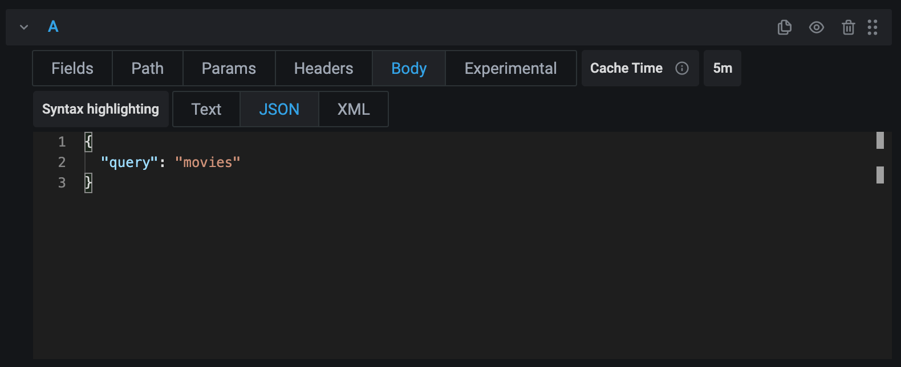

This page explains the what each part of the query editor does, and how you can configure it.

The query editor for the JSON API data source consists of a number of tabs. Each tab configures a part of the query.

### Fields

The **Fields** tab is where you select the data to extract from the JSON document returned by the URL configured in the data source configuration.

- **Field** must contain a valid JSONPath expression and can return one or more elements.
- **Type** defines the JSON type of the elements returned by the **Field** expression. By default, Grafana uses the types in the JSON document. If **Type** is set to a different type than the original property type, Grafana tries to parse the value.

  This can be useful in cases where the API returns quoted numbers, e.g. `"price": "3.49"`.

### Path

The drop-down box to the left lets you configure the **HTTP method** of the request sent to the URL and can be set to **GET** and **POST**.

The text box lets you append a path to the URL in the data source configuration. This can be used to dynamically change the request URL using [variables](https://grafana.com/docs/grafana/latest/variables/).

For example, by setting the path to `/movies/${movie}/summary` you can query the summary for any movie without having to change the query itself.

### Params

Add any parameters you'd like to send as part of the query string. For example, the parameters in the screenshot gets encoded as `?category=movies`.

Both the **Key** and **Value** fields support [variables](https://grafana.com/docs/grafana/latest/variables/).

> **Note:** Any query parameters that have been set by the administrator in the data source configuration has higher priority and overrides the parameters set by the query.

### Headers

Add any parameters you'd like to send as HTTP headers.

Both the **Key** and **Value** fields support [variables](https://grafana.com/docs/grafana/latest/variables/).

### Body

Sets the text to send as a request body.

- **Syntax highlighting** sets the active syntax for the editor. This is only for visual purposes and doesn't change the actual request.

> **Note:** Due to limitations in modern browsers, Grafana ignores the request body if the HTTP method is set to GET.

## Macros

Use macros in your query string and JSON Path queries to add dashboard context to your queries.

| Macro                | Description                                                               |
|----------------------|---------------------------------------------------------------------------|
| `$__unixEpochFrom()` | Start of the dashboard time interval as a Unix timestamp, i.e. 1494410783 |
| `$__unixEpochTo()`   | End of the dashboard time interval as a Unix timestamp, i.e. 1494410783   |
